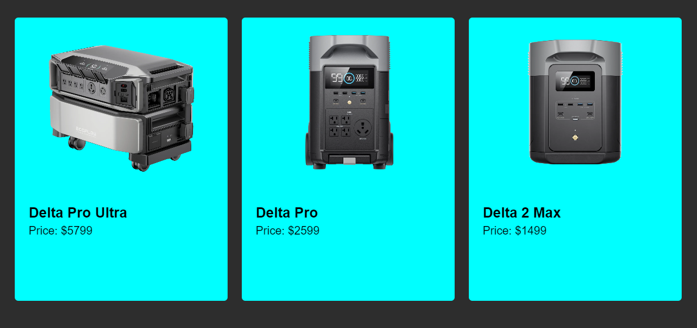

# CSS-3D-clickable-flip-cards

This is a simple website showcasing EcoFlow's range of portable power stations. Each product is displayed on a 3D flip card, providing product information and a "Buy Now" button that links to the EcoFlow website for purchasing.



## Features

- Three products displayed as interactive flip cards.
- Hover over a card to see additional product details.
- Click the "Buy Now" button on each card to visit the EcoFlow website for purchasing.
- Responsive design suitable for various screen sizes.

## Technologies Used

- HTML
- CSS

## How to Use

1. Clone this repository to your local machine:

   ```bash
   git clone https://github.com/malikjunaidk00/CSS-3D-clickable-flip-cards.git
